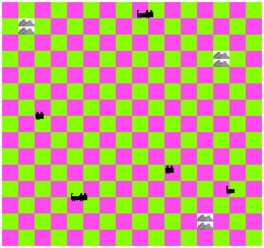

# Dog Meets Cat

Author: Wenxuan Ou

Design: Floor changes color when you are moving. The cats will also move with you!

Screen Shot:

How Your Asset Pipeline Works:

The assets are created using GIMP. Then they are converted from png to .tile and .palette by asset_proc.cpp. Tiles and palette will then be read by PPU and rendered in game.

How To Play:

Try to reach destination and avoid those sneaky cats!

Sources: All assets are created by myself.

This game was built with [NEST](NEST.md).

